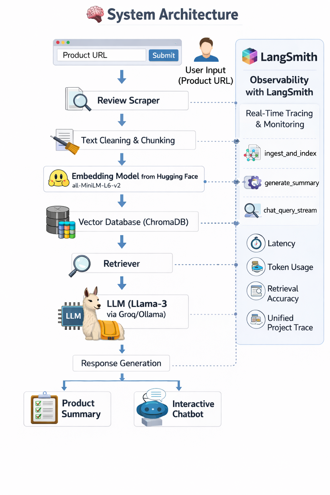
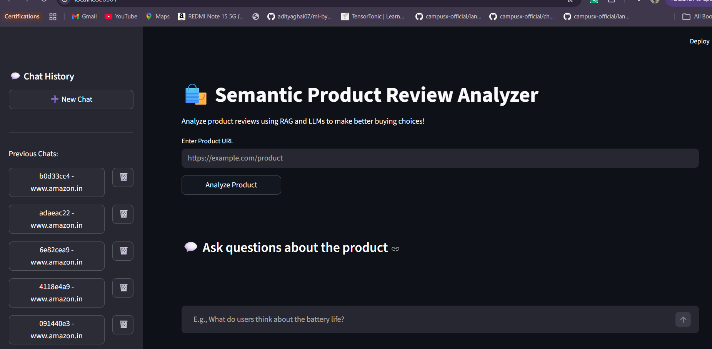

# 🛒 Semantic Product Review Analyzer

AI-powered review intelligence to help users make smarter buying decisions.

The **Semantic Product Review Analyzer** is a **Retrieval-Augmented Generation (RAG)** based application that transforms thousands of scattered product reviews into **clear, actionable insights**.

Instead of manually reading hundreds of reviews on e-commerce platforms, users can simply paste a **product URL**.  
The system automatically extracts the reviews, analyzes customer sentiment, and generates **structured summaries and interactive insights**.

A built-in **Product Expert chatbot** allows users to ask detailed questions about the product, with answers grounded strictly in **real user feedback**.

---

# 📌 Table of Contents

- [Overview](#-overview)
- [Key Features](#-key-features)
- [System Architecture](#-system-architecture)
- [Tech Stack](#-tech-stack)
- [Observability with LangSmith](#-observability-with-langsmith)
- [Installation](#️-installation)
- [Environment Setup](#-environment-setup)
- [Running the Application](#️-running-the-application)
- [Example Use Cases](#-example-use-cases)
- [Future Improvements](#-future-improvements)
- [License](#-license)

---

# 🔍 Overview

Online shopping often requires reading through **hundreds or thousands of customer reviews** to understand a product’s real performance.

This project solves that problem using **Retrieval-Augmented Generation (RAG)**.

The system:

- Extracts reviews from product pages
- Converts reviews into **vector embeddings**
- Stores them in a **vector database**
- Uses an **LLM** to generate summaries and answer questions grounded in review data

The result is a **review intelligence engine** that turns unstructured feedback into **meaningful decisions**.

---

# 🚀 Key Features

## URL → Insights

Users paste a **product URL**, and the system automatically:

- Scrapes product reviews
- Cleans and processes the text
- Converts them into embeddings
- Stores them in a vector database

---

## AI Generated Verdict

The system generates a structured product analysis including:

- ✅ **Pros**
- ❌ **Cons**
- 📊 **Overall Verdict**

This allows users to instantly understand the **collective customer sentiment**.

---

## Interactive Product Expert Chatbot

Users can ask questions such as:

- *Is the battery life good for gaming?*
- *Does the phone heat during heavy use?*
- *Is the camera good in low light?*

The chatbot:

- Retrieves **relevant review snippets**
- Generates answers grounded **only in customer reviews**

---

## Out-of-Context Guardrails

To maintain reliability, the chatbot detects and rejects questions unrelated to product data.

Example:

**User**

Who invented the iPhone?

**System Response**

This question is outside the available review data.

---

## Advanced Observability

The project integrates **LangSmith tracing** to monitor:

- Request lifecycle
- Retrieval accuracy
- Token usage
- Latency
- RAG pipeline execution

All system components are traced within a **single unified project tree**.

---

# 🧠 System Architecture

Click to View Architecture

  

---

### Architecture Flow

User Input (Product URL)
│
▼
Review Scraper
│
▼
Text Cleaning & Chunking
│
▼
Embedding Generation
(HuggingFace - all-MiniLM-L6-v2)
│
▼
Vector Database (ChromaDB)
│
▼
Retriever
│
▼
LLM (Llama-3 via Groq/Ollama)
│
▼
Response Generation
│
├── Product Summary
└── Interactive Chatbot

---

# 🛠 Tech Stack

### Language
Python

### LLM
Meta **Llama-3.3**

### LLM Providers
- Groq API
- Ollama (local inference)

### Embedding Model
HuggingFace  
`sentence-transformers/all-MiniLM-L6-v2`

### AI Framework
LangGraph

### Vector Database
ChromaDB

### Observability
LangSmith

### UI
Streamlit

---

# 📊 Observability with LangSmith

This project includes advanced **observability and tracing** using **LangSmith**.

Each user request is traced across the full pipeline:

- `ingest_and_index`
- `generate_summary`
- `chat_query_stream`

All traces are grouped into a **single project execution tree**, allowing developers to monitor:

- LLM latency
- Token usage
- Retrieval quality
- RAG pipeline behavior

This makes **debugging and optimization significantly easier**.

Project UI

---

# ⚙️ Installation

### 1️⃣ Clone the Repository

git clone https://github.com/Talha-Sid01/Semantic-Product-Review-Analyzer.git

cd Semantic-Product-Review-Analyzer

---

### 2️⃣ Install Dependencies

pip install -r requirements.txt

---

# 🔑 Environment Setup

Create a `.env` file in the root directory.

GROQ_API_KEY=your_groq_api_key
HUGGINGFACEHUB_API_TOKEN=your_huggingface_token

LangSmith Observability

LANGSMITH_TRACING=true
LANGSMITH_ENDPOINT=https://api.smith.langchain.com

LANGSMITH_API_KEY=your_langsmith_api_key
LANGSMITH_PROJECT="Product Review Analyzer"

---

# ▶️ Running the Application

Start the Streamlit interface:

streamlit run app.py

Then open your browser and paste a **product URL** to begin analysis.

---

# 💡 Example Use Cases

### Smart Online Shopping

Quickly determine if a product is worth buying without reading hundreds of reviews.

### Competitive Product Analysis

Compare products based on real user sentiment.

### Market Research

Analyze customer feedback patterns across products.

### Consumer Insights

Identify recurring complaints or praised features.

---

# Future Improvements

- Multi-product comparison
- Sentiment trend visualization
- Support for multiple e-commerce platforms
- Review authenticity detection
- Voice-based product queries
- Chrome extension for instant analysis

---

# 📄 License

This project is open-source and available under the **MIT License**.
